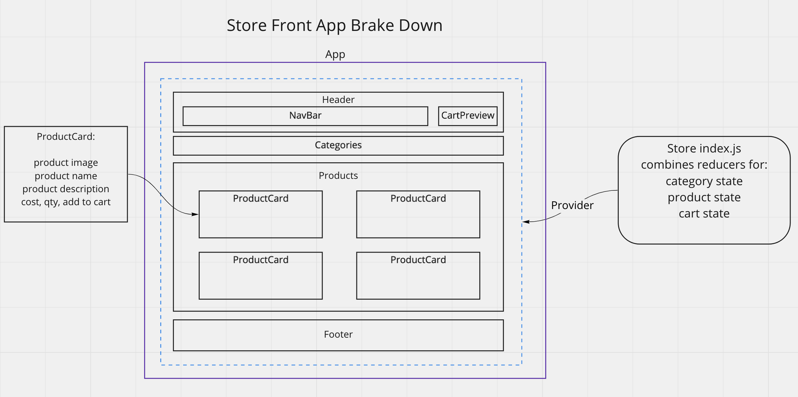

# Mock Store Front

## Deployed URL
https://esavage-storefront.netlify.app/

## About The Project
CodeFellows Lab Assignment to build...

A web application power a mock online storefront that will allow our users to browse our product offerings by category, place items in their shopping cart, and check-out when they are ready to make their purchase.

## Built With
 - React.js
 - Sass
 - MaterialUI
 - nanoid

## Getting Started

This folder only contains the components required for your React Application.

1. Run `npx create-react-app storefront --use-npm` to create your react application.
1. `cd storefront` and replace the `src` folder generated by CRA with the `src` folder in this starter-code folder.
1. Run `npm start` to visually validate that your starter-code components are working properly.

## Usage

Will outline useful examples here.

## UML

## Roadmap

Phase 1: Application Setup
- [X] Basic React Application
- [X] Redux State Management
- [X] State managed in memory
- [X] Material UI Components & Styling

Phase 2: Shopping Cart
- [x] Add items to a shopping cart
- [x] Update quantities
- [x] Remove items from the cart
- [x] Show the cart in real-time on the UI

Phase 3: Live Data
- [ ] Connect the application a live API
- [ ] Persist changes to products based on cart activity.
Phase 4: Checkout & Detail Pages
- [ ] Refactor the store to use the latest Redux design pattern (Redux Toolkit)
- [ ] Add a cart checkout page
- [ ] Add a product details page

## License
Distributed under the MIT License. See LICENSE.txt for more information.

## Contact
Erik Savage

Project Link: https://github.com/eriksavage/storefront

## Acknowledgements

- Code Fellows Code 401: Advanced Software Development in Full-Stack JavaScript Course
- othneildrew's [Best-README-Template](https://github.com/othneildrew/Best-README-Template)
- [React Docs](https://reactjs.org/docs/getting-started.html)
- [Sass Documentation](https://sass-lang.com/documentation)
- Kellen Linse, Janiel Jackson